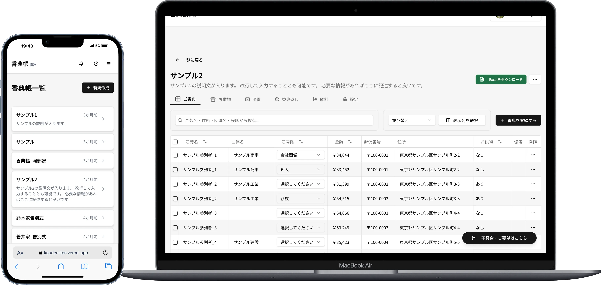

# 香典帳アプリ（Kouden）

## 概要
香典帳アプリは、葬儀や法要における香典や供物の記録・管理をデジタル化し、効率的に行えるWebアプリケーションです。

## 主な機能
- 香典・供物の記録管理
  - 参列者情報の登録と管理
  - 香典・供物の金額・品目の記録
  - お返しの記録と管理
- チーム機能
  - 複数人での共同編集
  - 招待リンクによるメンバー追加
  - リアルタイムな更新反映
- 利便性
  - PWA対応によるオフライン使用
  - レスポンシブデザインでのモバイル対応
  - 直感的なUIによる簡単操作

## スクリーンショット


## 技術スタック
### フロントエンド
- Next.js 15
- TypeScript
- Tailwind CSS
- shadcn/ui（UIコンポーネント）
- Jotai（状態管理）

### バックエンド
- Supabase（PostgreSQL）

### インフラストラクチャ
- Vercel（ホスティング）
- Bun（ランタイム/パッケージマネージャー）
- Biome（Linter/Formatter）


## 開発環境のセットアップ
### 必要条件
- Bun 1.0.0以上
- Node.js 18.0.0以上

### インストール手順
1. リポジトリのクローン
```bash
git clone https://github.com/yourusername/kouden.git
cd kouden
```

2. 依存関係のインストール
```bash
bun install
```

3. 環境変数の設定
```bash
cp .env.example .env.local
```
以下の環境変数を`.env.local`に設定してください：
- `NEXT_PUBLIC_SUPABASE_URL`: SupabaseのプロジェクトURL
- `NEXT_PUBLIC_SUPABASE_ANON_KEY`: SupabaseのAnonymous Key

4. 開発サーバーの起動
```bash
bun dev
```

アプリケーションは http://localhost:3000 で起動します。

## デプロイ
このアプリケーションはVercelにデプロイされています。

### デプロイ手順
1. Cloudflare Pagesでプロジェクトを作成
2. GitHubリポジトリと連携
3. ビルド設定
   - フレームワークプリセット: Next.js
   - ビルドコマンド: `bun run build`
   - ビルド出力ディレクトリ: `.next`
4. 環境変数の設定
   - 開発環境と同じ環境変数を設定

### 注意事項
- PWA機能を有効にするには、HTTPSが必要です

## ライセンス
このプロジェクトは[MITライセンス](LICENSE)の下で公開されています。

## コントリビューション
プロジェクトへの貢献を歓迎します。以下の手順で貢献をお願いします：

1. このリポジトリをフォーク
2. 新しいブランチを作成 (`git checkout -b feature/amazing-feature`)
3. 変更をコミット (`git commit -m 'Add some amazing feature'`)
4. ブランチにプッシュ (`git push origin feature/amazing-feature`)
5. プルリクエストを作成

### コントリビューションガイドライン
- コーディング規約に従ってください
- コミットメッセージは具体的に書いてください
- 大きな変更の場合は、事前にIssueを作成してください
- プルリクエストにはテストを含めてください

## 作者
- Akimasa Sugai ([@otomatty](https://github.com/otomatty))
