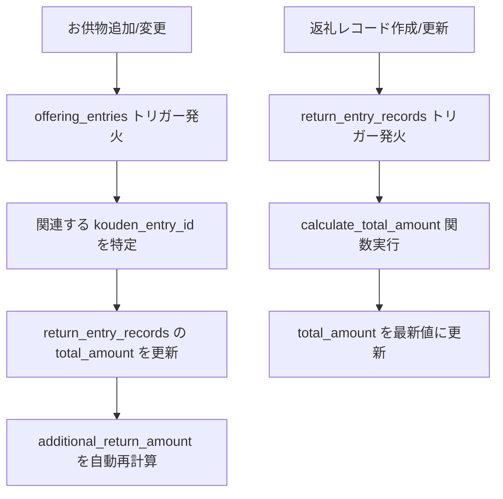

# 返礼品管理システム 実装・セキュリティガイド

## 目次

1. [実装概要](#実装概要)
2. [設計変更の背景](#設計変更の背景)
3. [データベース設計](#データベース設計)
4. [データベース関数](#データベース関数)
5. [トリガーと自動化](#トリガーと自動化)
6. [ビューとクエリ最適化](#ビューとクエリ最適化)
7. [セキュリティ設定（RLS）](#セキュリティ設定rls)
8. [フロントエンド実装ガイド](#フロントエンド実装ガイド)
9. [テスト方法](#テスト方法)
10. [保守・運用ガイド](#保守運用ガイド)

---

## 実装概要

返礼品管理システムv2では、従来の複雑な設計を全面的に見直し、以下の改善を実現しました：

### 主な改善点

- **設計のシンプル化**: 二重管理を解消し、香典エントリー主体の単一テーブル構造
- **自動計算機能**: お供物を含む合計金額の自動計算で整合性を保証
- **セキュリティ強化**: 多層防御による堅牢なアクセス制御
- **パフォーマンス最適化**: ビューとインデックスによる高速データアクセス
- **機能拡張**: 会葬品一括処理、進捗可視化機能を追加

---

## 設計変更の背景

### 従来設計の問題点

#### 1. 二重管理による複雑性
```sql
-- 旧設計: 複雑な二重構造
return_records (香典帳レベル)
├── koden_id → koudens.id
└── return_record_entries (エントリーレベル)
    ├── return_record_id → return_records.id
    └── kouden_entry_id → kouden_entries.id
```

**問題:**
- データの整合性維持が困難
- フロントエンド実装時の混乱
- 不必要な JOIN 処理

#### 2. 不適切な外部キー参照
- `return_records.koden_id` が `koudens.id` を参照
- 個別エントリー管理が実質不可能
- 香典帳レベルでの粗い管理しかできない

#### 3. 手動計算による非効率性
- `assigned_amount` の手動計算
- お供物追加時の更新漏れリスク
- データ不整合の発生

#### 4. セキュリティホール
- RLSポリシーの未設定
- 権限チェックの不備
- 不正アクセスのリスク

### 新設計の方針

1. **Single Source of Truth**: 一つのテーブルで完結する設計
2. **自動計算**: トリガーによる整合性保証
3. **セキュリティファースト**: 多層防御の実装
4. **パフォーマンス重視**: 最適化されたクエリとインデックス

---

## データベース設計

### メインテーブル: `return_entry_records`

```sql
CREATE TABLE return_entry_records (
  id uuid PRIMARY KEY DEFAULT uuid_generate_v4(),
  
  -- 関連情報
  kouden_entry_id uuid NOT NULL REFERENCES kouden_entries(id) ON DELETE CASCADE,
  
  -- 金額情報（自動計算）
  total_amount bigint NOT NULL DEFAULT 0,
  funeral_gift_amount bigint NOT NULL DEFAULT 0,
  additional_return_amount bigint GENERATED ALWAYS AS (
    GREATEST(0, total_amount - funeral_gift_amount)
  ) STORED,
  
  -- 返礼状況
  return_status text NOT NULL DEFAULT 'PENDING' 
    CHECK (return_status IN ('PENDING', 'PARTIAL_RETURNED', 'COMPLETED', 'NOT_REQUIRED')),
  
  -- 返礼内容
  return_method text,
  return_items jsonb,
  arrangement_date date,
  remarks text,
  
  -- 監査情報
  created_by uuid NOT NULL REFERENCES auth.users(id),
  created_at timestamptz NOT NULL DEFAULT NOW(),
  updated_at timestamptz NOT NULL DEFAULT NOW(),
  
  -- 制約
  CONSTRAINT unique_kouden_entry_return_record UNIQUE (kouden_entry_id)
);
```

#### カラム詳細

| カラム名 | データ型 | 説明 | 自動更新 |
|----------|----------|------|----------|
| `id` | uuid | 主キー | - |
| `kouden_entry_id` | uuid | 香典エントリーID（一意） | - |
| `total_amount` | bigint | 香典+お供物合計金額 | ✅ トリガー |
| `funeral_gift_amount` | bigint | 会葬品返礼額 | - |
| `additional_return_amount` | bigint | 追加返礼必要額 | ✅ 計算カラム |
| `return_status` | text | 返礼状況 | - |
| `return_method` | text | 返礼方法 | - |
| `return_items` | jsonb | 返礼品詳細 | - |
| `arrangement_date` | date | 手配日 | - |
| `remarks` | text | 備考 | - |

#### 返礼状況定義

| ステータス | 説明 | 表示名 |
|------------|------|--------|
| `PENDING` | 未対応 | 未対応 |
| `PARTIAL_RETURNED` | 一部返礼済み | 一部返礼済 |
| `COMPLETED` | 返礼完了 | 返礼完了 |
| `NOT_REQUIRED` | 返礼不要 | 返礼不要 |

---

## データベース関数

### 1. 合計金額自動計算関数

```sql
CREATE OR REPLACE FUNCTION calculate_total_amount(entry_id uuid)
RETURNS bigint AS $$
DECLARE
  kouden_amount bigint;
  offering_total bigint;
BEGIN
  -- 香典金額を取得
  SELECT amount INTO kouden_amount
  FROM kouden_entries 
  WHERE id = entry_id;
  
  -- 紐づくお供物の合計金額を取得
  SELECT COALESCE(SUM(o.price), 0) INTO offering_total
  FROM offering_entries oe
  JOIN offerings o ON oe.offering_id = o.id
  WHERE oe.kouden_entry_id = entry_id
    AND o.price IS NOT NULL;
  
  RETURN COALESCE(kouden_amount, 0) + COALESCE(offering_total, 0);
END;
$$ LANGUAGE plpgsql;
```

**用途:**
- 香典金額とお供物金額の自動合計
- トリガーから呼び出される
- データ整合性の保証

### 2. 会葬品一括返礼処理関数

```sql
CREATE OR REPLACE FUNCTION bulk_mark_funeral_gift_returned(
  kouden_id_param uuid,
  funeral_gift_amount_param bigint,
  performed_by uuid DEFAULT NULL
)
RETURNS TABLE (
  updated_count integer,
  affected_entries jsonb
) 
SECURITY DEFINER
```

**機能:**
- 指定香典帳の全エントリーに会葬品返礼額を一括設定
- 返礼状況の自動判定・更新
- 権限チェック付きセキュア実行

**使用例:**
```sql
SELECT * FROM bulk_mark_funeral_gift_returned(
  '香典帳ID',
  3000,  -- 会葬品金額（円）
  auth.uid()
);
```

### 3. 個別返礼状況更新関数

```sql
CREATE OR REPLACE FUNCTION update_return_status(
  entry_id uuid,
  new_status text,
  new_funeral_gift_amount bigint DEFAULT NULL,
  return_method_param text DEFAULT NULL,
  return_items_param jsonb DEFAULT NULL,
  arrangement_date_param date DEFAULT NULL,
  remarks_param text DEFAULT NULL
)
RETURNS boolean 
SECURITY DEFINER
AS $$
```

**機能:**
- 個別エントリーの返礼情報更新
- UPSERT処理（レコード存在時は更新、未存在時は作成）
- 権限チェック付きセキュア実行
- 部分更新対応（NULL以外のパラメータのみ更新）

### 4. セキュアビュー取得関数

```sql
-- 返礼品管理一覧の安全な取得
CREATE OR REPLACE FUNCTION get_return_management_summary(kouden_id_param uuid)
RETURNS TABLE (...) SECURITY DEFINER AS $$

-- 香典帳返礼サマリーの安全な取得  
CREATE OR REPLACE FUNCTION get_kouden_return_summary(kouden_id_param uuid)
RETURNS TABLE (...) SECURITY DEFINER AS $$
```

**特徴:**
- `SECURITY DEFINER` による安全な実行
- 関数内での詳細な権限チェック
- 直接ビューアクセスより安全

---

## トリガーと自動化

### 1. 返礼レコード自動更新トリガー

```sql
CREATE TRIGGER trigger_update_return_entry_total
  BEFORE INSERT OR UPDATE OF kouden_entry_id
  ON return_entry_records
  FOR EACH ROW
  EXECUTE FUNCTION update_return_entry_total();
```

**動作:**
- レコード挿入・更新時に `total_amount` を自動計算
- データ整合性を自動保証

### 2. お供物変更時の連動更新トリガー

```sql
CREATE TRIGGER trigger_offering_entries_change
  AFTER INSERT OR UPDATE OR DELETE
  ON offering_entries
  FOR EACH ROW
  EXECUTE FUNCTION update_related_return_entries();
```

**動作:**
- お供物の追加・変更・削除時に関連返礼レコードを自動更新
- リアルタイムでの金額同期

### トリガー処理フロー



---

## ビューとクエリ最適化

### 1. 返礼品管理一覧ビュー

```sql
CREATE VIEW return_management_summary AS
SELECT 
  ke.kouden_id,
  ke.id as kouden_entry_id,
  ke.name,
  ke.organization,
  ke.position,
  r.name as relationship_name,
  ke.amount as kouden_amount,
  
  -- お供物情報の集計
  COALESCE(offering_summary.offering_count, 0) as offering_count,
  COALESCE(offering_summary.offering_total, 0) as offering_total,
  
  -- 返礼品情報（デフォルト値含む）
  COALESCE(rer.total_amount, ke.amount + COALESCE(offering_summary.offering_total, 0)) as total_amount,
  COALESCE(rer.return_status, 'PENDING') as return_status,
  COALESCE(rer.funeral_gift_amount, 0) as funeral_gift_amount,
  COALESCE(rer.additional_return_amount, ke.amount + COALESCE(offering_summary.offering_total, 0)) as additional_return_amount,
  
  -- 表示用フィールド
  CASE 
    WHEN COALESCE(rer.return_status, 'PENDING') = 'COMPLETED' THEN '返礼完了'
    WHEN COALESCE(rer.return_status, 'PENDING') = 'PARTIAL_RETURNED' THEN '一部返礼済'
    WHEN COALESCE(rer.return_status, 'PENDING') = 'NOT_REQUIRED' THEN '返礼不要'
    ELSE '未対応'
  END as status_display,
  
  -- 追加返礼判定
  ((ke.amount + COALESCE(offering_summary.offering_total, 0)) > COALESCE(rer.funeral_gift_amount, 0)) as needs_additional_return

FROM kouden_entries ke
LEFT JOIN relationships r ON ke.relationship_id = r.id
LEFT JOIN offering_summary ON ke.id = offering_summary.kouden_entry_id
LEFT JOIN return_entry_records rer ON ke.id = rer.kouden_entry_id;
```

### 2. 香典帳レベルサマリービュー

```sql
CREATE VIEW kouden_return_summary AS
SELECT 
  k.id as kouden_id,
  k.title,
  k.description,
  
  -- 統計情報
  COUNT(rms.kouden_entry_id) as total_entries,
  COUNT(CASE WHEN rms.return_status = 'COMPLETED' THEN 1 END) as completed_count,
  COUNT(CASE WHEN rms.return_status = 'PARTIAL_RETURNED' THEN 1 END) as partial_count,
  COUNT(CASE WHEN rms.return_status = 'PENDING' THEN 1 END) as pending_count,
  COUNT(CASE WHEN rms.needs_additional_return THEN 1 END) as needs_additional_count,
  
  -- 金額統計
  SUM(rms.total_amount) as total_amount_sum,
  SUM(rms.funeral_gift_amount) as funeral_gift_amount_sum,
  SUM(rms.additional_return_amount) as additional_return_amount_sum,
  
  -- 進捗率計算
  ROUND(
    COUNT(CASE WHEN rms.return_status = 'COMPLETED' THEN 1 END)::numeric / 
    NULLIF(COUNT(rms.kouden_entry_id), 0) * 100, 
    1
  ) as completion_rate

FROM koudens k
LEFT JOIN return_management_summary rms ON k.id = rms.kouden_id
GROUP BY k.id, k.title, k.description;
```

### インデックス最適化

```sql
-- 主要検索用インデックス
CREATE INDEX idx_return_entry_records_kouden_entry_id 
  ON return_entry_records(kouden_entry_id);
CREATE INDEX idx_return_entry_records_status 
  ON return_entry_records(return_status);
CREATE INDEX idx_return_entry_records_arrangement_date 
  ON return_entry_records(arrangement_date);

-- ビューの高速化用インデックス
CREATE INDEX idx_kouden_entries_kouden_id 
  ON kouden_entries(kouden_id);
CREATE INDEX idx_offering_entries_kouden_entry_id 
  ON offering_entries(kouden_entry_id);
CREATE INDEX idx_relationships_id 
  ON relationships(id);
```

---

## セキュリティ設定（RLS）

### Row Level Security ポリシー

#### 1. 香典帳オーナー用ポリシー

```sql
CREATE POLICY "return_entry_records_owner_access" 
  ON return_entry_records
  FOR ALL 
  TO authenticated
  USING (
    EXISTS (
      SELECT 1 
      FROM kouden_entries ke
      JOIN koudens k ON ke.kouden_id = k.id
      WHERE ke.id = return_entry_records.kouden_entry_id
        AND (k.owner_id = auth.uid() OR k.created_by = auth.uid())
    )
  );
```

#### 2. 編集者用ポリシー

```sql
CREATE POLICY "return_entry_records_editor_access" 
  ON return_entry_records
  FOR ALL 
  TO authenticated
  USING (
    EXISTS (
      SELECT 1 
      FROM kouden_entries ke
      JOIN koudens k ON ke.kouden_id = k.id
      JOIN kouden_members m ON m.kouden_id = k.id
      JOIN kouden_roles r ON m.role_id = r.id
      WHERE ke.id = return_entry_records.kouden_entry_id
        AND m.user_id = auth.uid()
        AND (r.name = 'editor' OR 'return.write' = ANY(r.permissions))
    )
  );
```

#### 3. 閲覧者用ポリシー

```sql
CREATE POLICY "return_entry_records_viewer_access" 
  ON return_entry_records
  FOR SELECT 
  TO authenticated
  USING (
    EXISTS (
      SELECT 1 
      FROM kouden_entries ke
      JOIN koudens k ON ke.kouden_id = k.id
      JOIN kouden_members m ON m.kouden_id = k.id
      JOIN kouden_roles r ON m.role_id = r.id
      WHERE ke.id = return_entry_records.kouden_entry_id
        AND m.user_id = auth.uid()
        AND (r.name = 'viewer' OR 'return.read' = ANY(r.permissions))
    )
  );
```

### 関数レベルセキュリティ

#### SECURITY DEFINER 設定

```sql
-- 全ての主要関数でSECURITY DEFINERを設定
CREATE OR REPLACE FUNCTION bulk_mark_funeral_gift_returned(...)
RETURNS TABLE (...) 
SECURITY DEFINER  -- 関数定義者権限で実行
SET search_path = public, extensions
AS $$
BEGIN
  -- 権限チェック
  IF NOT EXISTS (
    SELECT 1 FROM koudens k
    WHERE k.id = kouden_id_param
      AND has_edit_permission(auth.uid(), k.id)
  ) THEN
    RAISE EXCEPTION 'Access denied';
  END IF;
  
  -- 処理実行
  ...
END;
$$;
```

#### 実行権限制限

```sql
-- 公開実行権限を取り消し
REVOKE EXECUTE ON FUNCTION bulk_mark_funeral_gift_returned(...) FROM PUBLIC;
-- 認証済みユーザーのみに付与
GRANT EXECUTE ON FUNCTION bulk_mark_funeral_gift_returned(...) TO authenticated;
```

### セキュリティレベル一覧

| レベル | 対象 | 制御方法 | 説明 |
|--------|------|----------|------|
| テーブル | `return_entry_records` | RLS ポリシー | 行レベルアクセス制御 |
| 関数 | データベース関数 | `SECURITY DEFINER` + 権限チェック | 実行時権限検証 |
| ビュー | サマリービュー | アクセス権限制限 | 認証済みユーザーのみ |
| API | Supabase API | 統合認証 | JWT トークン検証 |

---

## フロントエンド実装ガイド

### 基本パターン

#### 1. 返礼品一覧取得

```typescript
// ✅ 推奨: セキュア関数経由
const { data: returnList, error } = await supabase
  .rpc('get_return_management_summary', {
    kouden_id_param: koudenId
  });

if (error) {
  if (error.message.includes('Access denied')) {
    // 権限不足の処理
    showErrorMessage('この香典帳にアクセスする権限がありません');
  } else {
    // その他のエラー処理
    showErrorMessage('データの取得に失敗しました');
  }
}
```

#### 2. 会葬品一括返礼処理

```typescript
const handleBulkFuneralGift = async (funeralGiftAmount: number) => {
  try {
    const { data, error } = await supabase
      .rpc('bulk_mark_funeral_gift_returned', {
        kouden_id_param: koudenId,
        funeral_gift_amount_param: funeralGiftAmount
      });

    if (error) throw error;

    const result = data[0];
    showSuccessMessage(
      `${result.updated_count}件のエントリーを更新しました`
    );
    
    // 一覧を再取得
    await refreshReturnList();
    
  } catch (error) {
    console.error('一括処理エラー:', error);
    showErrorMessage('一括処理に失敗しました');
  }
};
```

#### 3. 個別返礼状況更新

```typescript
const updateReturnStatus = async (
  entryId: string, 
  updateData: ReturnUpdateData
) => {
  try {
    const { data, error } = await supabase
      .rpc('update_return_status', {
        entry_id: entryId,
        new_status: updateData.status,
        return_method_param: updateData.method,
        return_items_param: updateData.items,
        arrangement_date_param: updateData.arrangementDate,
        remarks_param: updateData.remarks
      });

    if (error) throw error;

    showSuccessMessage('返礼情報を更新しました');
    await refreshReturnList();
    
  } catch (error) {
    console.error('更新エラー:', error);
    showErrorMessage('更新に失敗しました');
  }
};
```

### TypeScript型定義

```typescript
// 返礼品管理データの型定義
interface ReturnManagementEntry {
  kouden_id: string;
  kouden_entry_id: string;
  entry_name: string;
  organization?: string;
  entry_position?: string;
  relationship_name?: string;
  kouden_amount: number;
  offering_count: number;
  offering_total: number;
  total_amount: number;
  return_status: 'PENDING' | 'PARTIAL_RETURNED' | 'COMPLETED' | 'NOT_REQUIRED';
  funeral_gift_amount: number;
  additional_return_amount: number;
  return_method?: string;
  return_items?: ReturnItem[];
  arrangement_date?: string;
  remarks?: string;
  status_display: string;
  needs_additional_return: boolean;
}

interface ReturnItem {
  name: string;
  price: number;
  quantity: number;
  notes?: string;
}

interface ReturnUpdateData {
  status?: string;
  method?: string;
  items?: ReturnItem[];
  arrangementDate?: string;
  remarks?: string;
}

// 香典帳サマリーの型定義
interface KoudenReturnSummary {
  kouden_id: string;
  title: string;
  description?: string;
  total_entries: number;
  completed_count: number;
  partial_count: number;
  pending_count: number;
  needs_additional_count: number;
  total_amount_sum: number;
  funeral_gift_amount_sum: number;
  additional_return_amount_sum: number;
  completion_rate: number;
}
```

### エラーハンドリング

```typescript
// 統一エラーハンドリング関数
const handleReturnManagementError = (error: any, operation: string) => {
  console.error(`${operation} エラー:`, error);
  
  if (error?.message?.includes('Access denied')) {
    return {
      type: 'permission',
      message: 'この操作を行う権限がありません'
    };
  }
  
  if (error?.message?.includes('not found')) {
    return {
      type: 'notFound',
      message: '指定されたデータが見つかりません'
    };
  }
  
  if (error?.message?.includes('network')) {
    return {
      type: 'network',
      message: 'ネットワークエラーが発生しました'
    };
  }
  
  return {
    type: 'unknown',
    message: '予期しないエラーが発生しました'
  };
};
```

---

## テスト方法

### 1. 基本機能テスト

```sql
-- テストデータ準備
DO $$
DECLARE
  test_kouden_id uuid;
  test_entry_id uuid;
BEGIN
  -- テスト用香典帳作成
  INSERT INTO koudens (id, title, description, owner_id, created_by)
  VALUES (
    uuid_generate_v4(),
    'テスト香典帳',
    'システムテスト用',
    auth.uid(),
    auth.uid()
  ) RETURNING id INTO test_kouden_id;
  
  -- テスト用エントリー作成
  INSERT INTO kouden_entries (id, kouden_id, name, amount, created_by)
  VALUES (
    uuid_generate_v4(),
    test_kouden_id,
    'テスト参列者',
    10000,
    auth.uid()
  ) RETURNING id INTO test_entry_id;
  
  -- 返礼レコード作成テスト
  PERFORM update_return_status(
    test_entry_id,
    'PENDING',
    0,
    'テスト返礼方法',
    '{"items": [{"name": "テスト商品", "price": 3000}]}'::jsonb,
    CURRENT_DATE,
    'テスト備考'
  );
  
  RAISE NOTICE 'テストデータ作成完了: 香典帳ID %, エントリーID %', test_kouden_id, test_entry_id;
END $$;
```

### 2. セキュリティテスト

```sql
-- 権限テスト: 他人の香典帳にアクセス試行
DO $$
BEGIN
  -- 不正アクセステスト（例外が発生することを確認）
  BEGIN
    PERFORM get_return_management_summary('00000000-0000-0000-0000-000000000000');
    RAISE EXCEPTION 'セキュリティテスト失敗: 不正アクセスが阻止されませんでした';
  EXCEPTION
    WHEN OTHERS THEN
      RAISE NOTICE 'セキュリティテスト成功: 不正アクセスが適切に阻止されました';
  END;
END $$;
```

### 3. パフォーマンステスト

```sql
-- 大量データでのパフォーマンステスト
EXPLAIN (ANALYZE, BUFFERS)
SELECT * FROM return_management_summary 
WHERE kouden_id = 'your-kouden-id'
ORDER BY name;

-- インデックス効果の確認
EXPLAIN (ANALYZE, BUFFERS)
SELECT COUNT(*) FROM return_entry_records 
WHERE return_status = 'PENDING';
```

---

## 保守・運用ガイド

### 定期メンテナンス

#### 1. データ整合性チェック

```sql
-- 月次データ整合性チェッククエリ
WITH consistency_check AS (
  SELECT 
    rer.id,
    rer.kouden_entry_id,
    rer.total_amount as recorded_amount,
    calculate_total_amount(rer.kouden_entry_id) as calculated_amount
  FROM return_entry_records rer
)
SELECT 
  COUNT(*) as total_records,
  COUNT(*) FILTER (WHERE recorded_amount = calculated_amount) as consistent_records,
  COUNT(*) FILTER (WHERE recorded_amount != calculated_amount) as inconsistent_records
FROM consistency_check;
```

#### 2. パフォーマンス監視

```sql
-- インデックス使用状況の確認
SELECT 
  schemaname,
  tablename,
  indexname,
  idx_tup_read,
  idx_tup_fetch
FROM pg_stat_user_indexes 
WHERE tablename = 'return_entry_records'
ORDER BY idx_tup_read DESC;
```

#### 3. セキュリティ監査

```sql
-- RLSポリシーの設定確認
SELECT 
  schemaname,
  tablename,
  policyname,
  permissive,
  roles,
  cmd
FROM pg_policies 
WHERE tablename = 'return_entry_records';
```

### トラブルシューティング

#### 問題1: 金額の自動計算が動作しない

**症状:** お供物を追加しても`total_amount`が更新されない

**確認方法:**
```sql
-- トリガーの存在確認
SELECT * FROM pg_trigger 
WHERE tgname LIKE '%offering%' OR tgname LIKE '%return%';
```

**解決方法:**
```sql
-- トリガーを再作成
DROP TRIGGER IF EXISTS trigger_offering_entries_change ON offering_entries;
CREATE TRIGGER trigger_offering_entries_change
  AFTER INSERT OR UPDATE OR DELETE
  ON offering_entries
  FOR EACH ROW
  EXECUTE FUNCTION update_related_return_entries();
```

#### 問題2: 権限エラーが頻発する

**症状:** 正当なユーザーでもアクセス拒否される

**確認方法:**
```sql
-- ユーザーの権限状況確認
SELECT 
  k.title,
  k.owner_id,
  m.user_id,
  r.name as role_name,
  r.permissions
FROM koudens k
LEFT JOIN kouden_members m ON k.id = m.kouden_id
LEFT JOIN kouden_roles r ON m.role_id = r.id
WHERE m.user_id = auth.uid();
```

### バックアップとリストア

#### 定期バックアップ設定

```sql
-- 返礼品管理データのバックアップ
COPY (
  SELECT 
    rer.*,
    ke.name as entry_name,
    k.title as kouden_title
  FROM return_entry_records rer
  JOIN kouden_entries ke ON rer.kouden_entry_id = ke.id
  JOIN koudens k ON ke.kouden_id = k.id
) TO '/backup/return_management_backup_YYYYMMDD.csv' 
WITH (FORMAT CSV, HEADER);
```

### モニタリング指標

#### 1. システム健全性指標

- トリガー実行成功率
- 権限チェック実行時間
- データ整合性率

#### 2. ビジネス指標

- 返礼完了率の推移
- 平均処理時間
- ユーザー操作エラー率

---

## まとめ

### 実装により達成したこと

1. **設計のシンプル化**
   - 複雑な二重管理を単一テーブルに統合
   - 直感的なデータ構造で保守性向上

2. **自動化の実現**
   - お供物変更時の自動金額更新
   - データ整合性の自動保証

3. **セキュリティの強化**
   - 多層防御による堅牢な保護
   - 細かい権限制御の実現

4. **パフォーマンスの最適化**
   - 効率的なクエリとインデックス
   - ビューによる最適化

5. **機能の拡張**
   - 会葬品一括処理機能
   - リアルタイム進捗可視化

### 今後の拡張予定

- 返礼品在庫管理との連携
- 外部配送サービスAPI連携
- 返礼品推奨システム
- 分析・レポート機能の強化

**この実装により、返礼品管理システムは堅牢で効率的、かつ使いやすいシステムとなりました。** 